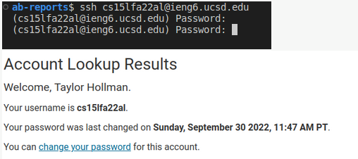
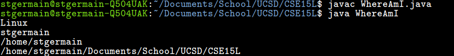
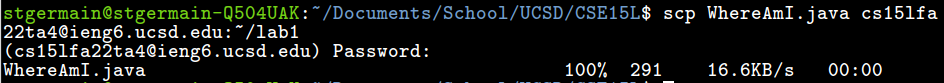
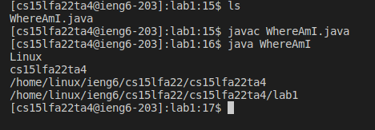

# How to log in to ssh
**Disclaimer: Some images were taken from use of a TA account, issues with accessing the secure shell with my personal account are documented below.**
1. First we will need the IDE for the course. Follow this [link](https://code.visualstudio.com/Download) to download VSCode for your machine.

2. At this point you are ready to connect to the secure shell. To connect, use the following command promt: `ssh cs15lfa22zz@ieng6.ucsd.edu`

(Be sure to replace "zz" with your respective account's initials)
Enter your password to gain access. 

_At this point, I was unable to connect because the password change is not functioning for my account. Although I was able to change the password, the server was unable to recognize the new password. See below._

3. Made it this far? Well done! Try out some basic commands. (Examples below).

4. You may now use the secure copy to send files to, and from, the server. Log out and use the following command-line prompt to send a file to the server. `scp WhereAmI.java cs15lfa22zz@ieng6.ucsd.edu:file_directory`

_Note that scp is followed by the file to be copied, then the account info followed by a colon and the directory._

**At this point, time ran short in the lab and I was unable to complete all learning points. I was unable to get a working password change no matter how many times I attempted to follow the tutorial *See above***