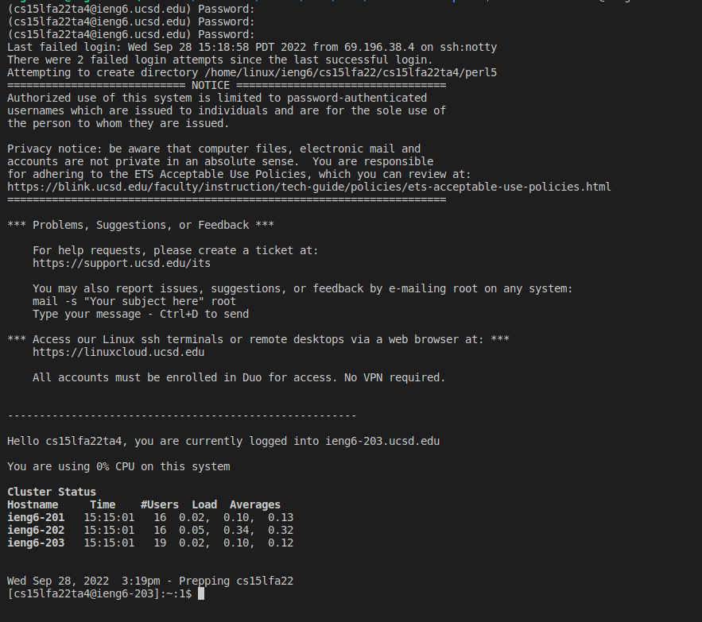

# How to log in to ssh
**Disclaimer: Some images were taken from use of a TA account, issues with accessing the secure shell with my personal account are documented below.**
1. First we will need the IDE for the course. Follow this [link](https://code.visualstudio.com/Download) to download VSCode for your machine.


2. After opening vscode, go to the "Terminal" drop down menu and select "New Terminal". This should open a terminal window in vscode. To connect to the remote server, use the following command: `ssh cs15lfa22zz@ieng6.ucsd.edu`

(Be sure to replace "zz" with your respective account's initials)
Enter your password to gain access. 




3. Trying basic terminal commands:

    In the image below, we see some examples.

    a)  `pwd` shows the absolute directory path you are currently inhabiting.

    b) `ls` shows folders and files in your current directory (folders are in blue )

    c) `ls -a` shows *all* folders and files, including hidden ones!

    d) `cd` followed by a folder name, will change your directory and move you into the named folder.

    e) `.` and `..` represent the *current* and *previous* (the directory one step above in the heiarchy) directories respectively.


4. You may now use the secure copy to send files to, and from, the server. Log out and use the following command-line prompt to send a file to the server. `scp WhereAmI.java cs15lfa22al@ieng6.ucsd.edu:/home/linux/ieng6/cs15lfa22/cs15lfa22al/lab1` (Be sure to replace "al" with your account's initials! Be sure that WhereAmI.java is in the current path you are in on your local machine).

**WhereAmI.java contents:**

```
class WhereAmI {
     public static void main(String[] args) {
       System.out.println(System.getProperty("os.name"));
       System.out.println(System.getProperty("user.name"));
       System.out.println(System.getProperty("user.home"));
       System.out.println(System.getProperty("user.dir"));
     }
   }

```

_Note that scp is followed by the file to be copied, then the account info followed by a colon and the directory._

   Now, compile and run the code!

   

5. We are ready to generate an ssh key. This will allow us to call `scp` or `ssh` without having to input the profile password each time.

    `ssh-keygen` will create a public and private key on your computer. Just press Enter when given the prompt below to send it to the *default* path. Press Enter two more times to ensure no password, and allow the decryption of the key to process authentication.

    Now you will need to secure copy the *public* key to the server. On the server, make a directory: `mkdir ~/.ssh/`. Then on the client side, run this command with your respective local path and server username: `scp /home/stgermain/.ssh/id_rsa.pub cs15lfa22al@ieng6.ucsd.edu`.
    Now you should be able to login to the server without a password!

    